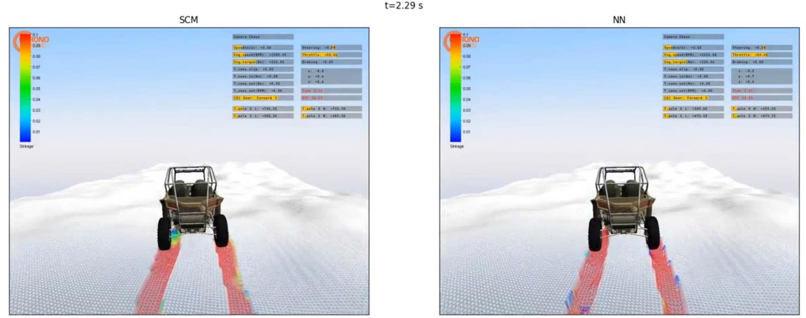

# SCM Unet

[](https://opensource.org/licenses/MIT)




---

## Description

Deep learning model to replace terramechanics computations in Chrono simulator.

Terramechanics simulations make use of a variety of numerical methods such as the [Soil Contact Model (SCM)](https://core.ac.uk/download/pdf/11138706.pdf), a simple but effective approach to compute deformations and forces on the solid bodies, which is supported by the [Chrono simulator](https://projectchrono.org/). Here we present a deep learning-based method to replace the SCM computations to compute the deformations, with the aim of maintain the accuracy of the original simulator. This surrogate model is trained with oracle simulations generated with Chrono, and makes use of a height-map representation which is processed by a Unet network.


## Usage

### NN training

To train a NN in SCM Chrono simulations, follow the next steps:
- Generate a Chrono training dataset, using [this branch](https://github.com/PabloVD/chrono/tree/scm_unet) of Chrono and running `chrono_runner.py`.
- Specify settings in `Source/init.py` such as the path to the training dataset.
- Train the model using `TrainChrono.py`.
- Run the notebook `PlotHmaps.ipynb` for some visualizations of input and output data.
- Run `timewrapper.py` to generate a torchscript wrapped version of the model which can be run in Chrono, and also to compute performance statistics.

### Run the NN in Chrono

NN integration in Chrono is currently supported for wheeled vehicles (Polaris specifically, see [here](https://github.com/PabloVD/chrono/tree/scm_unet/src/projects/polaris/scm_nn)) and for the rover Curiosity (see [here](https://github.com/PabloVD/chrono/tree/scm_unet/src/projects/polaris/scm_nn)). Only NN model trained with Polaris is provided. Support for terrain height maps is included.

To run the trained NN in Chrono, follow the next steps:

- First, clone [this branch](https://github.com/PabloVD/chrono/tree/scm_unet) of Chrono and compile it in a `build` folder in the standard way. Be sure to include `libtorch` and CUDA dependencies.
- Then, place the model `wrapped_unet_cuda_batch_4.pt` (or any desired new version of the model) in `build/data/vehicle/terrain/scm`.
- Run a Chrono script querying the NN using for instance:

```
./test_Polaris_SCM_CustomTerrain --tend=3 --throttle=1 --steering=0 --use_nn=1
```

or run using `chrono_runner.py`, specifying the path to terrain height maps if needed. See [here](https://github.com/PabloVD/chrono/tree/scm_unet/src/projects/polaris/scm_nn) for more info on the scripts with NN support. 
- A couple of notebooks are provided to compare results using the NN with standard SCM. Once a SCM reference simulation or set of simulations have been run with their equivalent counterparts using the NN, use `SimulationsAnalysis.ipynb` to quantify the accuracy of the NN results comprared to the ground truth and `ChronoSCMTimer.ipynb` for performance comparisons.

## Contact


Feel free to contact me for comments or questions at <pablo.villanueva.domingo@gmail.com>.


